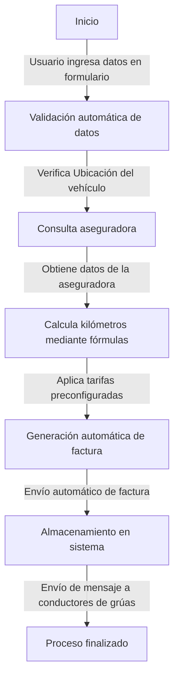

```mermaid
flowchart TD
  A[Inicio] -->|Usuario ingresa datos en formulario| B[Validación automática de datos]
  B -->|Verifica Ubicación del vehículo| C[Consulta aseguradora]
  C -->|Obtiene datos de la aseguradora| D[Calcula kilómetros mediante fórmulas]
  D -->|Aplica tarifas preconfiguradas| E[Generación automática de factura]
  E -->|Envío automático de factura| F[Almacenamiento en sistema]
  F -->|Envío de mensaje a conductores de grúas| G[Proceso finalizado]
```
